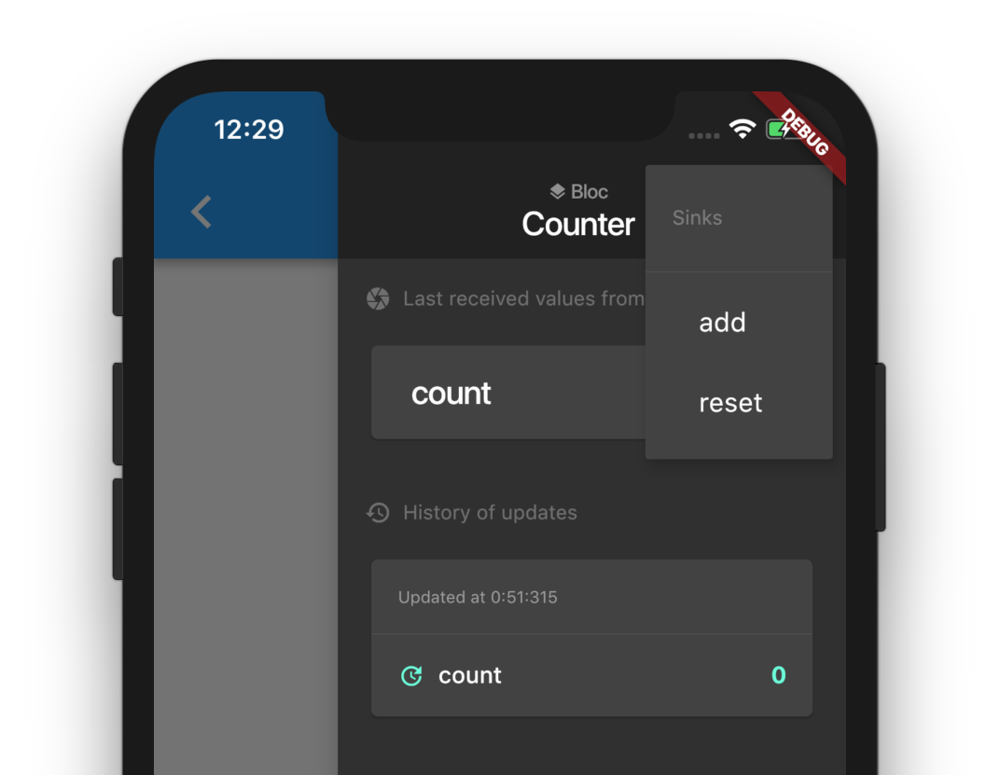

# flutter_bloc_debug

A set of helper tools for debugging your BLoCs.

## Bloc debug views

If you start by designing your BLoCs, it can be tedious to test them in real condition (if you have native dependencies and so on), and sometimes you don't have time to create a full set of unit tests for them during your prototyping phase.

With `BlocDebugger` and `BlocDebugDrawer`, a form is generated to allow you to display all of the `Streams` values, and to send values to `Sinks`.



### Quickstart

```dart
class CounterBloc {
  Sink<int> get add => ...
  Sink<void> get reset => ...
  Stream<int> get count => ...
}
```

```dart
Widget build(BuildContext context) {
     return BlocDebugger(
      title: 'Counter',
      streams: {'count': this.bloc.count},
      sinks: {'add': this.bloc.add, 'reset': this.bloc.reset},
      child: Scaffold(
          body: Counter(this.bloc), // The view you're working on
          endDrawer: BlocDebugDrawer()),
    );
}
```

### Generated bloc debugger declaration

If you use my other package [built_bloc](https://www.github.com/aloisdeniel/built_bloc), all the metadata of a bloc is generated and you simply have to call `BlocDebugger.fromMetadata(bloc.metadata, ...)`.

## Examples

For more detailled examples take a look at the [example folder](https://www.github.com/aloisdeniel/flutter_bloc_debug/example).
